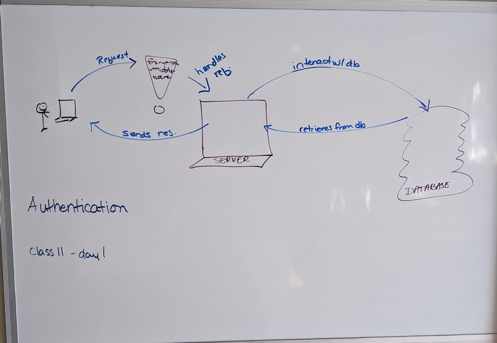

# LAB Authentication - Class 11

## Project: Authentication

### Author: Ashley Biermann

### Links and Resources

- [submission PR](https://github.com/401-advanced-javascript-ashley-biermann/auth-server/pull/1)
- [ci/cd](https://github.com/401-advanced-javascript-ashley-biermann/notes/tree/master/.github/workflows) (GitHub Actions)
- [back-end server url - net yet implemented]()
- [front-end application]()
- [api docs]()
- [jsdoc]()

### Setup

#### `.env` requirements (where applicable)

- `PORT`
- `MONGO_ATLAS_URI`
- `SECRET`

#### How to initialize/run your application (where applicable)

- `npm start`

#### How to use your library (where applicable)

#### Tests
- Testing not yet implemented
- Run with `npm test `

#### UML

#### Citations
- Class11 - Worked through class11 code during code review - used that to inform `generateToken()`, second part of `handleCreateUser()`, `authenticateUser()`, basic.js middleware